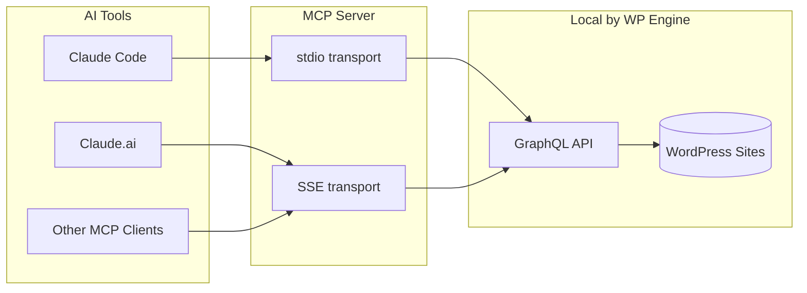
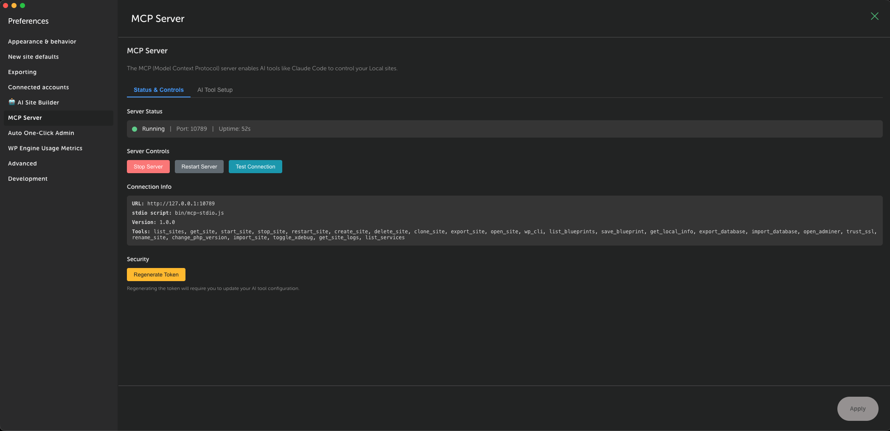
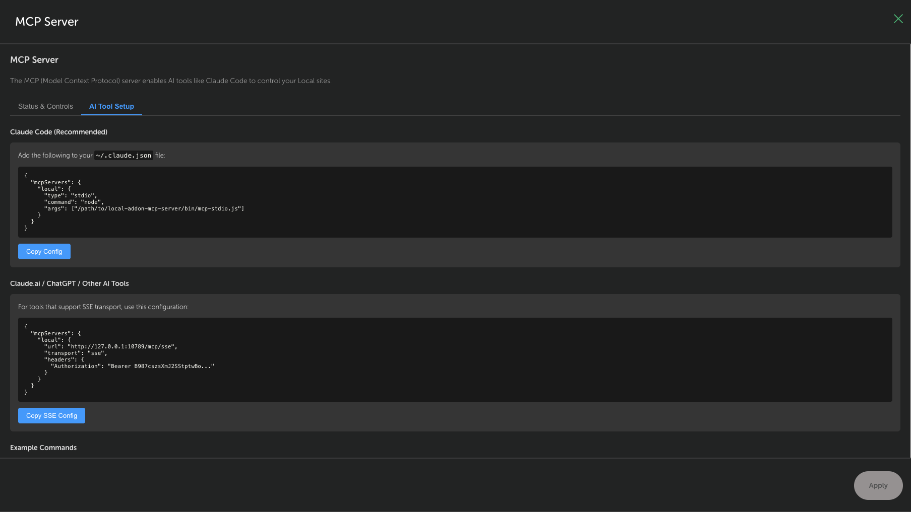

# MCP Server Addon for Local

This addon adds Model Context Protocol (MCP) server capabilities to Local by WP Engine, enabling AI assistants like Claude Code, Claude.ai, ChatGPT, and Gemini to manage WordPress development sites.

## Architecture



## Features

- **40 MCP Tools** - Complete site management, WP-CLI, database, backups, and WP Engine sync
- **Dual Transport** - stdio for Claude Code, SSE for web-based AI tools
- **Cloud Backups** - Backup and restore sites to Dropbox or Google Drive
- **WP Engine Connect** - Push and pull sites to/from WP Engine hosting
- **Security Hardened** - Input validation, command blocklists, confirmation requirements

## Installation

### Method 1: Pre-built Release (Recommended)

1. Go to the [Releases](https://github.com/jpollock/local-addon-mcp-server/releases) page
2. Download the latest `.tgz` file
3. Open Local → Add-ons
4. Click **Install from disk**
5. Select the downloaded `.tgz` file
6. Toggle the addon **ON**
7. Click **Relaunch**

### Method 2: Build from Source

```bash
git clone https://github.com/jpollock/local-addon-mcp-server.git
cd local-addon-mcp-server
npm install
npm run build
npm run install-addon
```

Restart Local, then enable the addon in Add-ons settings.

## Uninstallation

**If installed from disk:**

1. Open Local → Add-ons
2. Toggle the MCP Server addon **OFF**
3. Click **Remove**
4. Restart Local

**If installed from source:**

```bash
npm run uninstall-addon
```

Then restart Local.

## Using the Addon

After installation, access the MCP Server settings via **Local → Preferences → MCP Server**.

### Status & Controls Tab



- **Server Status** - View running state, port, and uptime
- **Server Controls** - Start, stop, restart, or test the connection
- **Connection Info** - URL, stdio script path, version, and available tools
- **Security** - Regenerate authentication token when needed

### AI Tool Setup Tab



- **Claude Code Configuration** - Copy-ready stdio config for `~/.claude.json`
- **SSE Configuration** - Copy-ready SSE config for Claude.ai/ChatGPT
- **Example Commands** - Sample prompts to try with your AI assistant

## Configure Claude Code

From the **AI Tool Setup** tab, click **Copy Config** to get the configuration, or manually add to `~/.claude.json`:

```json
{
  "mcpServers": {
    "local": {
      "command": "node",
      "args": ["/path/to/local-addon-mcp-server/bin/mcp-stdio.js"]
    }
  }
}
```

**Note:** Replace `/path/to` with the actual path. For pre-built releases, the path will be in Local's addons directory.

## Usage Examples

Ask Claude Code to:

- "List my Local sites"
- "Start the blog site"
- "Create a new site called test-project"
- "Run wp plugin list on my-site"
- "Clone my-site as my-site-copy"
- "Back up my-site to Google Drive"
- "Push my-site to WP Engine"

## MCP Tools (40 total)

### Core Site Management (14 tools)

| Tool              | Description                           |
| ----------------- | ------------------------------------- |
| `list_sites`      | List all WordPress sites in Local     |
| `get_site`        | Get detailed site information         |
| `start_site`      | Start a stopped site                  |
| `stop_site`       | Stop a running site                   |
| `restart_site`    | Restart a site                        |
| `create_site`     | Create a new WordPress site           |
| `delete_site`     | Delete a site (requires confirmation) |
| `wp_cli`          | Run WP-CLI commands                   |
| `get_local_info`  | Get Local version and status          |
| `open_site`       | Open site in browser                  |
| `clone_site`      | Clone an existing site                |
| `export_site`     | Export site to zip file               |
| `list_blueprints` | List available blueprints             |
| `save_blueprint`  | Save site as blueprint                |

### Database & Configuration (7 tools)

| Tool                 | Description                   |
| -------------------- | ----------------------------- |
| `export_database`    | Export database to SQL file   |
| `import_database`    | Import SQL file into database |
| `open_adminer`       | Open Adminer database UI      |
| `trust_ssl`          | Trust site SSL certificate    |
| `rename_site`        | Rename a WordPress site       |
| `change_php_version` | Change site PHP version       |
| `import_site`        | Import site from zip file     |

### Development & Debugging (3 tools)

| Tool            | Description                     |
| --------------- | ------------------------------- |
| `toggle_xdebug` | Enable/disable Xdebug           |
| `get_site_logs` | Get PHP, Nginx, MySQL logs      |
| `list_services` | List available service versions |

### Cloud Backups (7 tools)

| Tool               | Description                           |
| ------------------ | ------------------------------------- |
| `backup_status`    | Check cloud backup availability       |
| `list_backups`     | List backups from cloud provider      |
| `create_backup`    | Create backup to Dropbox/Google Drive |
| `restore_backup`   | Restore from cloud backup             |
| `delete_backup`    | Delete a cloud backup                 |
| `download_backup`  | Download backup as ZIP                |
| `edit_backup_note` | Update backup description             |

### WP Engine Connect (9 tools)

| Tool               | Description                    |
| ------------------ | ------------------------------ |
| `wpe_status`       | Check WP Engine auth status    |
| `wpe_authenticate` | Start OAuth authentication     |
| `wpe_logout`       | Clear WP Engine tokens         |
| `list_wpe_sites`   | List WP Engine sites           |
| `get_wpe_link`     | Get site's WPE connection info |
| `push_to_wpe`      | Push local changes to WPE      |
| `pull_from_wpe`    | Pull changes from WPE          |
| `get_sync_history` | Get push/pull history          |
| `get_site_changes` | Preview file changes           |

## Documentation

- [User Guide](docs/USER-GUIDE.md) - Setup instructions and usage
- [Developer Guide](docs/DEVELOPER-GUIDE.md) - Contributing and architecture
- [Troubleshooting](docs/TROUBLESHOOTING.md) - Common issues and solutions
- [RFC](docs/RFC-001-MCP-Server.md) - Technical specification

## Development

```bash
npm run build       # Build for production
npm run watch       # Watch mode for development
npm run lint        # Run ESLint
npm run test        # Run tests (108 tests)
npm run typecheck   # TypeScript type checking
```

## Security

The MCP server includes security hardening:

- **Localhost only** - Only accepts connections from 127.0.0.1
- **Token authentication** - Requires valid Bearer token
- **Confirmation required** - Destructive operations require `confirm: true`
- **WP-CLI blocklist** - Blocks dangerous commands (eval, shell, db query)
- **Input validation** - Validates snapshot IDs, SQL paths, and more

## Contributing

See [CONTRIBUTING.md](CONTRIBUTING.md) for development setup and guidelines.

## License

MIT - See [LICENSE](LICENSE) for details.
