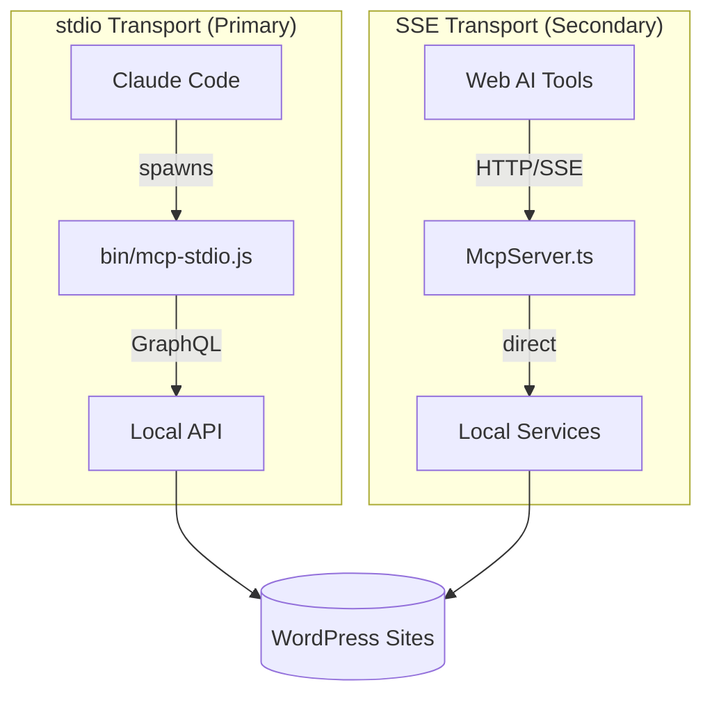
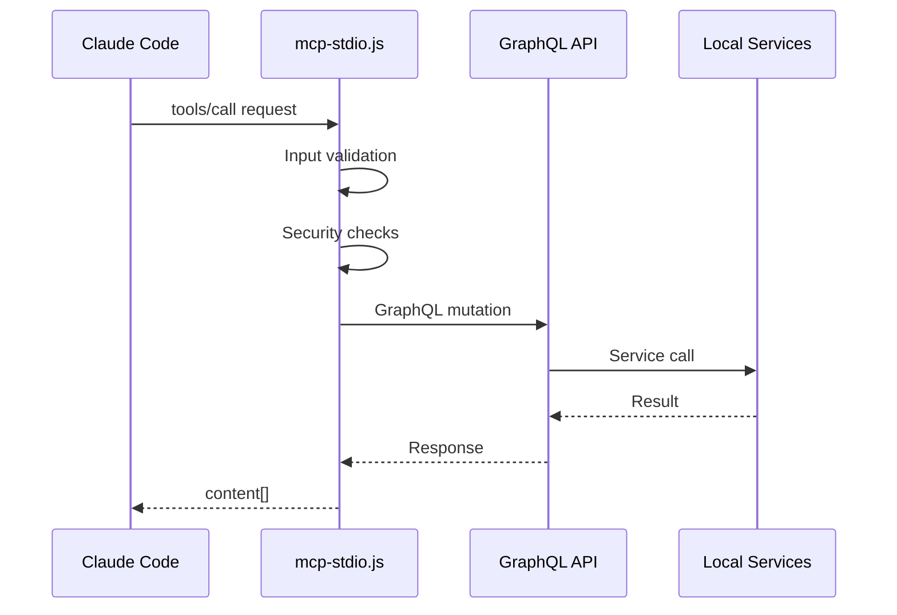
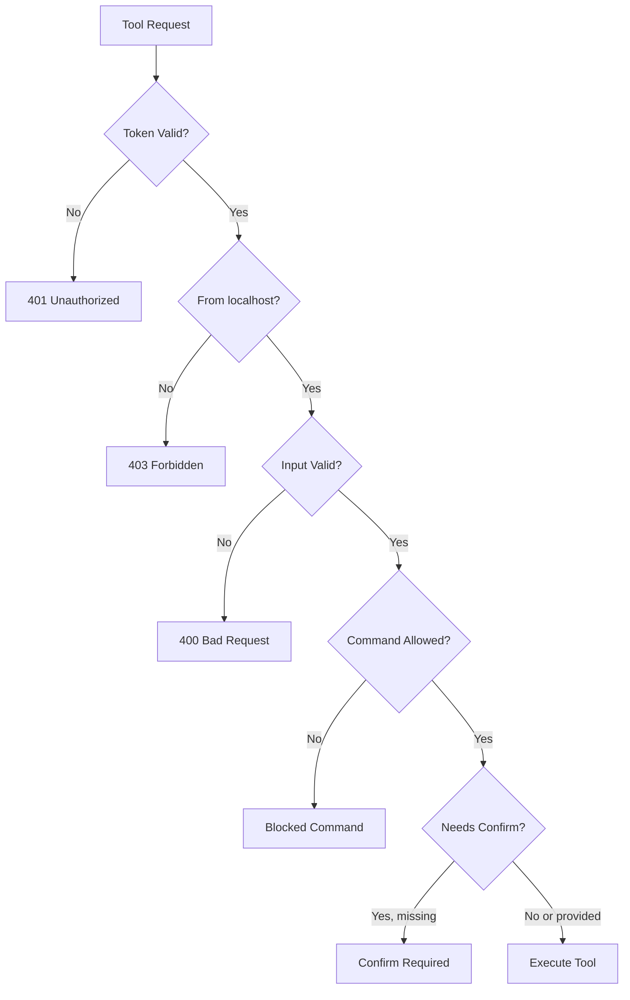

# MCP Server Developer Guide

This guide explains the architecture and implementation of the MCP Server addon for Local by WP Engine.

## Architecture Overview



## Project Structure

```
local-addon-mcp-server/
├── bin/
│   └── mcp-stdio.js              # stdio MCP transport (40 tools, all handlers)
├── src/
│   ├── common/
│   │   ├── constants.ts          # Server constants (ports, names)
│   │   └── types.ts              # TypeScript interfaces (LocalServices)
│   ├── main/
│   │   └── index.ts              # Addon entry + GraphQL mutations/resolvers
│   └── renderer/
│       ├── index.tsx             # Renderer entry point
│       └── components/           # Preferences UI components
├── tests/
│   ├── security.test.ts          # Security feature tests (25 tests)
│   ├── phase10-tools.test.ts     # Cloud Backup tests
│   ├── phase11-tools.test.ts     # WP Engine Connect tests
│   └── ...                       # Other test files
├── docs/
│   ├── USER-GUIDE.md
│   ├── DEVELOPER-GUIDE.md
│   ├── TROUBLESHOOTING.md
│   └── ...
└── todos/                        # Security and architecture notes
```

## Dual Transport Architecture

### 1. stdio Transport (Primary)

**File:** `bin/mcp-stdio.js`

The stdio transport is a standalone Node.js script that Claude Code spawns directly. It communicates with Local via Local's GraphQL API.



**Advantages:**
- Works reliably with Claude Code
- No complex SSE connection handling
- Self-contained, no Local process dependencies during tool execution

**How it works:**
```javascript
// mcp-stdio.js connects to Local's GraphQL
const info = getGraphQLConnectionInfo(); // Reads from connection info file
const response = await graphqlRequest(query, variables);
```

### 2. SSE Transport (Secondary)

**File:** `src/main/mcp/McpServer.ts`

The SSE transport runs inside Local's Electron process and has direct access to Local's service container.

**Used for:**
- Health checks (`/health` endpoint)
- Future browser-based AI tools
- Tools that need instant access to Local services

**Endpoints:**
| Endpoint | Method | Auth | Description |
|----------|--------|------|-------------|
| `/health` | GET | No | Health check |
| `/mcp/sse` | GET | Yes | SSE connection for MCP |
| `/mcp/messages` | POST | Yes | Tool invocation |

## Security Architecture

The MCP server implements multiple security layers:



### Security Features

1. **WP-CLI Command Blocklist**
   ```javascript
   const BLOCKED_WP_COMMANDS = [
     'eval',
     'eval-file',
     'shell',
     'db query',
     'db cli',
   ];
   ```

2. **Confirmation Requirements**
   - `delete_site` - Prevents accidental site deletion
   - `restore_backup` - Prevents accidental data loss
   - `push_to_wpe` - Prevents accidental production overwrites
   - `pull_from_wpe` - Prevents accidental local overwrites

3. **Input Validation**
   - `isValidSnapshotId()` - Validates restic snapshot ID format (hex, 8-64 chars)
   - `isValidSqlPath()` - Validates SQL file paths, prevents traversal attacks

4. **Timeout Handling**
   - Push/Pull operations: 5 minute timeout
   - Backup operations: 10 minute timeout

## Adding a New Tool

### Step 1: Add to stdio Transport

Edit `bin/mcp-stdio.js`:

```javascript
// Add tool definition to the tools array
const tools = [
  // ... existing tools
  {
    name: 'my_new_tool',
    description: 'Description of what this tool does',
    inputSchema: {
      type: 'object',
      properties: {
        site: { type: 'string', description: 'Site name or ID' },
        confirm: { type: 'boolean', description: 'Required for destructive ops' },
      },
      required: ['site'],
    },
  },
];

// Add handler in the handleTool switch statement
case 'my_new_tool': {
  // Input validation
  const site = await findSite(args.site);
  if (!site) {
    return {
      content: [{ type: 'text', text: `Site not found: ${args.site}` }],
      isError: true,
    };
  }

  // For destructive operations, require confirmation
  if (!args.confirm) {
    return {
      content: [{ type: 'text', text: JSON.stringify({
        error: 'This operation requires confirm=true'
      }) }],
      isError: true,
    };
  }

  // Execute via GraphQL
  const data = await graphqlRequest(`
    mutation { myMutation(siteId: "${site.id}") { success error } }
  `);

  return {
    content: [{ type: 'text', text: JSON.stringify(data, null, 2) }],
  };
}
```

### Step 2: Add GraphQL Mutation (if needed)

If your tool needs functionality not exposed in Local's GraphQL API, add a mutation in `src/main/index.ts`:

```typescript
const typeDefs = gql`
  input MyToolInput {
    siteId: ID!
  }

  type MyToolResult {
    success: Boolean!
    error: String
  }

  extend type Mutation {
    myToolMutation(input: MyToolInput!): MyToolResult!
  }
`;

const resolvers = {
  Mutation: {
    myToolMutation: async (_parent, args) => {
      const { siteId } = args.input;
      const site = siteData.getSite(siteId);
      // Use internal services
      return { success: true };
    },
  },
};
```

### Step 3: Add Tests

Create tests in `tests/` following existing patterns:

```typescript
describe('my_new_tool', () => {
  it('should require site parameter', () => {
    // Test input validation
  });

  it('should require confirmation for destructive operations', () => {
    // Test confirm requirement
  });
});
```

## Local Services API

The `LocalServices` interface provides access to Local's internal services:

```typescript
interface LocalServices {
  // Core services
  siteData: {
    getSites(): Record<string, any>;
    getSite(id: string): any | undefined;
    updateSite?(siteID: string, site: Partial<{ name: string; xdebugEnabled: boolean }>): void;
  };

  siteProcessManager: {
    start(site: any): Promise<void>;
    stop(site: any): Promise<void>;
    restart(site: any): Promise<void>;
    getSiteStatus(site: any): Promise<string>;
  };

  wpCli: {
    run(site: any, args: string[], opts?: any): Promise<string | null>;
  };

  deleteSite: {
    deleteSite(opts: { site: any; trashFiles: boolean; updateHosts: boolean }): Promise<void>;
  };

  addSite: {
    addSite(opts: {
      newSiteInfo: { siteName: string; siteDomain: string; ... };
      wpCredentials?: { adminUsername?: string; adminPassword?: string; adminEmail?: string };
    }): Promise<any>;
  };

  localLogger: {
    info(message: string, ...args: any[]): void;
    warn(message: string, ...args: any[]): void;
    error(message: string, ...args: any[]): void;
  };

  // Phase 8: Extended services
  browserManager?: { openURL(url: string): Promise<void>; };
  cloneSite?: (site: any, newName: string) => Promise<any>;
  exportSite?: (site: any, outputPath: string) => Promise<void>;
  blueprints?: { getBlueprints(): Promise<any[]>; saveBlueprint(...): Promise<any>; };
  adminer?: { open(site: any): Promise<void>; };
  x509Cert?: { trustCert(site: any): Promise<void>; };
  siteProvisioner?: { swapService(...): Promise<void>; };
  importSite?: { run(settings: { zipPath: string; siteName: string }): Promise<any>; };

  // Phase 9: Lightning Services
  lightningServices?: {
    getRegisteredServices(role?: string): Record<string, Record<string, any>>;
    getServices(role?: string): Promise<Record<string, Record<string, any>>>;
  };

  // Phase 10: Cloud Backups
  backup?: {
    createBackup(args: { site: any; provider: string; accountId: string; note?: string }): Promise<{ snapshotId: string; timestamp: string }>;
    listBackups(args: { site: any; provider: string; accountId: string }): Promise<Array<{ snapshotId: string; timestamp: string; note?: string; ... }>>;
    restoreBackup(args: { site: any; provider: string; accountId: string; snapshotId: string }): Promise<void>;
    deleteBackup(args: { site: any; provider: string; accountId: string; snapshotId: string }): Promise<void>;
    downloadZip(args: { ... }): Promise<string>;
    editBackupDescription(args: { ... }): Promise<void>;
  };
  dropbox?: { isAuthenticated(accountId: string): Promise<boolean>; getAccount(accountId: string): Promise<{ id: string; email: string } | undefined>; };
  googleDrive?: { isAuthenticated(accountId: string): Promise<boolean>; getAccount(accountId: string): Promise<{ id: string; email: string } | undefined>; };

  // Phase 11: WP Engine Connect
  wpeOAuth?: {
    getAccessToken(): Promise<string | undefined>;
    authenticate(): Promise<{ accessToken: string; refreshToken: string; idToken: string }>;
    clearTokens(): Promise<void>;
  };
  capi?: {
    getInstallList(): Promise<any[] | undefined>;
    getAccountList(): Promise<any[] | undefined>;
    getCurrentUser(): Promise<{ id?: string; email?: string } | undefined>;
    getInstall(installId: string): Promise<{ id: string; name: string; ... } | undefined>;
  };
  wpePush?: {
    push(args: { includeSql?: boolean; wpengineInstallName: string; ... }): Promise<void>;
    pushDatabase(args: { ... }): Promise<void>;
  };
  wpePull?: {
    pull(args: { includeSql?: boolean; wpengineInstallName: string; ... }): Promise<void>;
    pullDatabase(args: { ... }): Promise<void>;
  };
  connectHistory?: {
    getEvents(siteId: string): Array<{ remoteInstallName?: string; timestamp: number; ... }>;
  };
  wpeConnectBase?: {
    listModifications(args: { connectArgs: { ... }; direction: 'push' | 'pull'; }): Promise<Array<{ path: string; type: string; ... }>>;
  };
}
```

## Testing

### Running Tests

```bash
npm run test              # Run all tests (108 tests)
npm run test:watch        # Watch mode
npm run test:coverage     # With coverage report
npm run test -- tests/security.test.ts  # Run specific file
```

### Test Categories

| File | Tests | Purpose |
|------|-------|---------|
| `security.test.ts` | 25 | Security validations |
| `phase10-tools.test.ts` | 17 | Cloud Backup tools |
| `phase11-tools.test.ts` | 15 | WP Engine Connect tools |
| `phase8-tools.test.ts` | 17 | Database/config tools |
| `phase9-tools.test.ts` | 11 | Dev/debug tools |

### Testing stdio Transport

```bash
# Test directly with JSON-RPC
echo '{"jsonrpc":"2.0","id":1,"method":"tools/list"}' | node bin/mcp-stdio.js

# Test tool execution
echo '{"jsonrpc":"2.0","id":1,"method":"tools/call","params":{"name":"list_sites","arguments":{}}}' | node bin/mcp-stdio.js
```

## Debugging

### Logs

Check Local's logs for addon output:
- macOS: `~/Library/Logs/Local/local.log`
- Windows: `%LOCALAPPDATA%\Local\logs\local.log`

The addon logs with `[MCP Server]` prefix:
```
[MCP Server] MCP server started on port 10789
[MCP Server] Running WP-CLI: wp plugin list
```

### stdio Transport Debugging

Add debug output to stderr (doesn't interfere with MCP protocol):
```javascript
console.error('[DEBUG] Processing request:', method);
```

## Development Workflow

```bash
# Install dependencies
npm install

# Development build with watch
npm run watch

# Create symlink (first time only)
ln -sf "$(pwd)" "$HOME/Library/Application Support/Local/addons/local-addon-mcp-server"

# After changes:
# - stdio changes: No restart needed
# - Main process changes: Restart Local
# - Renderer changes: Cmd+R in Local (with dev menu enabled)
```

## Resources

- [MCP Specification](https://spec.modelcontextprotocol.io/)
- [Local Addon Development](https://localwp.com/docs/addons)
- [Local by WP Engine](https://localwp.com)
- [Electron Documentation](https://www.electronjs.org/docs)
