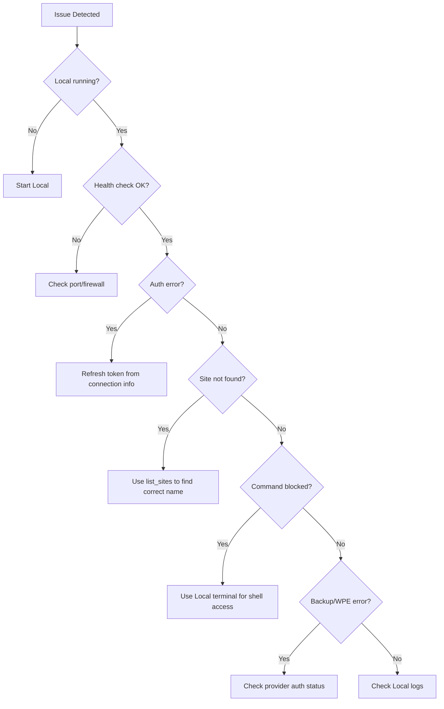

# MCP Server Troubleshooting Guide

This guide helps diagnose and resolve common issues with the MCP Server.

## Diagnostic Flowchart



## Quick Diagnostics

### Check if MCP Server is Running

```bash
curl http://127.0.0.1:10789/health
```

**Expected response:**
```json
{
  "status": "ok",
  "version": "1.0.0",
  "uptime": 123.456,
  "tools": ["list_sites", "start_site", ...]
}
```

### Check Connection Info File

**macOS:**
```bash
cat ~/Library/Application\ Support/Local/mcp-connection-info.json
```

**Windows (PowerShell):**
```powershell
Get-Content "$env:APPDATA\Local\mcp-connection-info.json"
```

**Linux:**
```bash
cat ~/.config/Local/mcp-connection-info.json
```

## Common Issues

### Issue: Connection Refused

**Symptoms:**
- `curl: (7) Failed to connect to localhost port 10789`
- AI tool reports "connection refused"

**Causes & Solutions:**

1. **Local is not running**
   - Open Local by WP Engine
   - Wait for it to fully load
   - The MCP server starts automatically with Local

2. **MCP server is on a different port**
   - Check the connection info file for the actual port
   - The server may have chosen a different port if 10789 was unavailable

3. **Firewall blocking connections**
   - The server only binds to localhost, so firewalls shouldn't affect it
   - Check if any security software is blocking localhost connections

### Issue: 401 Unauthorized

**Symptoms:**
- `{"error":"Unauthorized: Invalid or missing authentication token"}`

**Causes & Solutions:**

1. **Missing Authorization header**
   - Ensure you're including: `Authorization: Bearer YOUR_TOKEN`

2. **Wrong token**
   - Get the current token from the connection info file
   - Tokens regenerate each time Local starts

3. **Token expired or stale**
   - Restart Local to get a fresh token
   - Update your AI tool configuration with the new token

### Issue: 403 Forbidden

**Symptoms:**
- `{"error":"Forbidden: Only localhost connections allowed"}`

**Causes & Solutions:**

1. **Connecting from non-localhost**
   - The MCP server only accepts connections from 127.0.0.1
   - Ensure your AI tool is running on the same machine as Local

### Issue: Site Not Found

**Symptoms:**
- `Site not found: "my-site". Available sites: site1, site2, ...`

**Causes & Solutions:**

1. **Wrong site name**
   - Site names are matched case-insensitively with partial matching
   - Use `list_sites` to see exact names and IDs

2. **Site was deleted**
   - The site may have been removed from Local
   - Create a new site or check your site list

### Issue: Site Not Running

**Symptoms:**
- `Site "my-site" is not running. Start it first with the start_site tool.`

**Causes & Solutions:**

1. **Site needs to be started**
   - Use `start_site` tool before running WP-CLI commands
   - Wait for the site to fully start

### Issue: WP-CLI Command Failed

**Symptoms:**
- `WP-CLI error: ...`

**Causes & Solutions:**

1. **Invalid command syntax**
   - Commands should be passed as arrays: `["plugin", "list", "--format=json"]`
   - Check WP-CLI documentation for correct syntax

2. **Site not fully started**
   - Wait a few seconds after starting a site before running commands
   - Some commands may fail during site startup

3. **Plugin/theme errors**
   - The MCP server runs WP-CLI with `--skip-plugins` and `--skip-themes` by default
   - This prevents most plugin-related errors

### Issue: WP-CLI Command Blocked

**Symptoms:**
- `Command 'eval' is blocked for security reasons. Use Local's terminal for shell access.`

**Causes & Solutions:**

1. **Security blocklist active**
   - The following commands are blocked for security: `eval`, `eval-file`, `shell`, `db query`, `db cli`
   - Use Local's built-in terminal for these operations
   - This is intentional to prevent AI agents from executing arbitrary code

### Issue: Invalid Snapshot ID

**Symptoms:**
- `Error: Invalid snapshot ID format. Expected hex string (8-64 characters).`

**Causes & Solutions:**

1. **Wrong ID format**
   - Use `list_backups` to get valid snapshot IDs
   - Snapshot IDs are hex strings like `1b6ea6c9b2bd83af...`

2. **Using Hub database ID instead of hash**
   - The MCP server uses restic hashes, not Hub database IDs
   - Always copy the snapshotId from `list_backups` output

### Issue: Create Site Failed

**Symptoms:**
- `Failed to create site: ...`

**Causes & Solutions:**

1. **Site name already exists**
   - Choose a different site name
   - Delete the existing site first if you want to reuse the name

2. **Invalid characters in name**
   - Avoid special characters in site names
   - Stick to letters, numbers, and hyphens

3. **Disk space issues**
   - Check available disk space
   - Local sites require several hundred MB each

### Issue: Delete Site Failed

**Symptoms:**
- `Deletion not confirmed. You must set confirm=true to delete a site.`

**Causes & Solutions:**

1. **Missing confirmation**
   - The delete_site tool requires `confirm: true` as a safety measure
   - This prevents accidental deletions

## Cloud Backup Issues

### Issue: Backup Status Shows Not Available

**Symptoms:**
- `backup_status` returns `featureEnabled: false`

**Causes & Solutions:**

1. **Cloud Backups addon not installed**
   - Install the Cloud Backups addon from Local's marketplace

2. **No providers authenticated**
   - Authenticate with Dropbox or Google Drive in Local's Cloud Backups settings

### Issue: List Backups Returns Empty

**Symptoms:**
- `list_backups` returns empty array

**Causes & Solutions:**

1. **Wrong provider specified**
   - Use exactly `dropbox` or `googleDrive` (case-sensitive)
   - Check `backup_status` to see which providers are authenticated

2. **No backups exist for this site**
   - Create a backup first with `create_backup`

### Issue: Restore Backup Failed

**Symptoms:**
- `Failed to restore backup: ...`

**Causes & Solutions:**

1. **Site not running**
   - Start the site before restoring: use `start_site` first

2. **Invalid snapshot ID**
   - Use the hash from `list_backups`, not the numeric ID

3. **Missing confirmation**
   - Restore requires `confirm: true`

## WP Engine Connect Issues

### Issue: WPE Status Shows Not Authenticated

**Symptoms:**
- `wpe_status` returns `authenticated: false`

**Causes & Solutions:**

1. **Not logged in**
   - Use `wpe_authenticate` to start OAuth flow
   - Complete authentication in browser

2. **Token expired**
   - Tokens may expire; re-authenticate if needed

### Issue: Push/Pull Failed

**Symptoms:**
- `Push to WP Engine timed out after 300 seconds`
- `Pull from WP Engine failed: ...`

**Causes & Solutions:**

1. **Network issues**
   - Check your internet connection
   - Large sites may take longer than the 5-minute timeout

2. **Site not connected**
   - Use `get_wpe_link` to check if site is connected to WP Engine
   - Connect the site in Local's WP Engine Connect panel

3. **Missing confirmation**
   - Both push and pull require `confirm: true`

### Issue: No WPE Sites Listed

**Symptoms:**
- `list_wpe_sites` returns empty array

**Causes & Solutions:**

1. **Not authenticated**
   - Use `wpe_authenticate` first

2. **No sites in account**
   - The WP Engine account may have no installs
   - Check your WP Engine portal

## Viewing Logs

Local's logs can help diagnose issues:

**macOS:**
```bash
# View recent Local logs
tail -100 ~/Library/Logs/Local/local.log 2>/dev/null || echo "Check Local's log location"
```

**Windows:**
Check `%LOCALAPPDATA%\Local\log\`

**Linux:**
Check `~/.local/share/Local/log/`

## Resetting the MCP Server

If the MCP server is in a bad state:

1. Quit Local completely
2. Delete the connection info file (optional)
3. Restart Local
4. The MCP server will restart with a fresh token

## Diagnostic Commands

### Full System Check

```bash
#!/bin/bash
echo "=== MCP Server Diagnostics ==="
echo ""

# Check if Local is running
echo "1. Checking if Local is running..."
pgrep -f "Local.app" > /dev/null && echo "   ✓ Local is running" || echo "   ✗ Local is NOT running"
echo ""

# Check health endpoint
echo "2. Checking MCP health endpoint..."
health=$(curl -s http://127.0.0.1:10789/health 2>/dev/null)
if [ -n "$health" ]; then
    echo "   ✓ MCP server is responding"
    echo "   $health"
else
    echo "   ✗ MCP server is NOT responding"
fi
echo ""

# Check connection info file
echo "3. Checking connection info file..."
if [ -f "$HOME/Library/Application Support/Local/mcp-connection-info.json" ]; then
    echo "   ✓ Connection info file exists"
    cat "$HOME/Library/Application Support/Local/mcp-connection-info.json" | python3 -m json.tool 2>/dev/null
else
    echo "   ✗ Connection info file NOT found"
fi
echo ""

# Check GraphQL connection
echo "4. Checking GraphQL connection..."
if [ -f "$HOME/Library/Application Support/Local/graphql-connection-info.json" ]; then
    echo "   ✓ GraphQL connection info exists"
else
    echo "   ✗ GraphQL connection info NOT found (Local may not be running)"
fi
echo ""

echo "=== Diagnostics Complete ==="
```

Save as `mcp-diagnostics.sh` and run with `bash mcp-diagnostics.sh`.

## Getting More Help

1. **Check Local Community Forums**: https://community.localwp.com
2. **Enable Debug Logging**: Look for debug options in Local's preferences
3. **Report Issues**: File issues at the project repository
