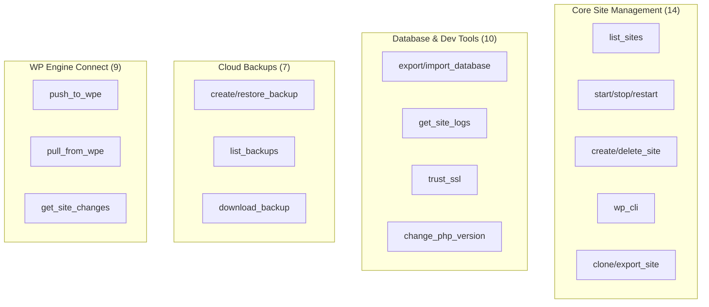
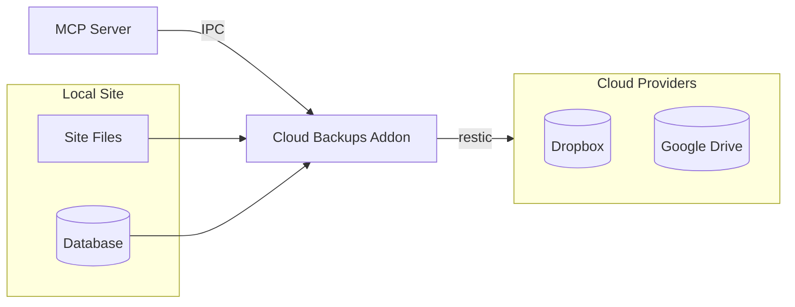
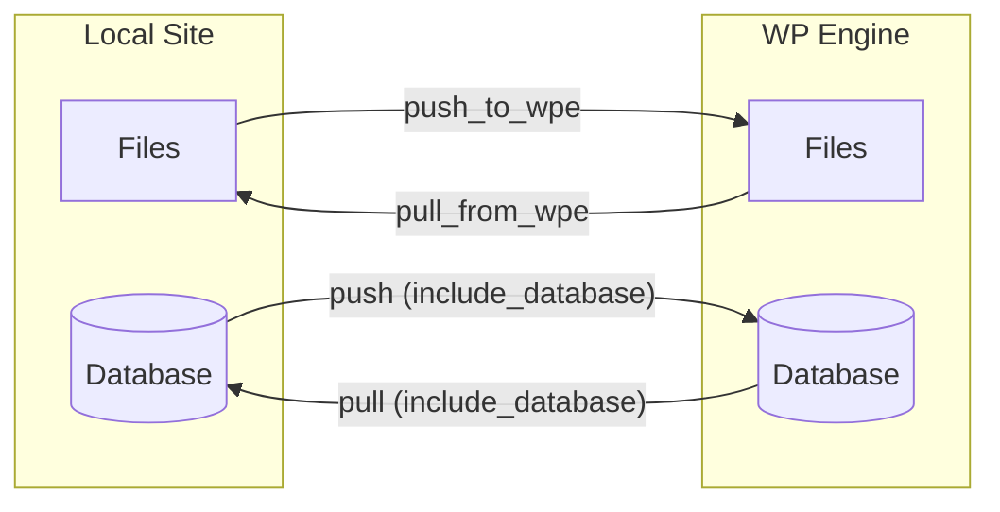

# MCP Server User Guide

The MCP (Model Context Protocol) Server enables AI tools like Claude Code, Claude.ai, ChatGPT, and other MCP-compatible assistants to control your Local WordPress sites.

## What is MCP?

MCP is an open protocol that allows AI assistants to interact with external tools and services. With the MCP Server enabled in Local, you can use natural language to:

- List your WordPress sites
- Start, stop, and restart sites
- Run WP-CLI commands
- Create and delete sites
- Back up sites to cloud storage
- Push and pull to WP Engine

## Tool Categories (40 tools)



## Quick Start

### 1. Open the MCP Server Preferences

Go to **Local → Preferences → MCP Server** to access the addon's control panel.


The panel has two tabs:

#### Status & Controls Tab

- **Server Status** - Shows if the server is running, the port number, and uptime
- **Server Controls** - Buttons to start, stop, restart, or test the connection
- **Connection Info** - Displays the URL, stdio script path, version, and list of available tools
- **Security** - Regenerate the authentication token (you'll need to update your AI tool config afterward)

#### AI Tool Setup Tab

- **Claude Code (Recommended)** - Pre-formatted stdio configuration to copy into `~/.claude.json`
- **Claude.ai / ChatGPT / Other AI Tools** - SSE configuration with your auth token
- **Example Commands** - Sample prompts to try with your AI assistant

### 2. Verify the Server is Running

The MCP Server starts automatically when Local launches. In the Preferences panel, you should see:

- Green indicator showing "Running"
- Port number (default: 10789)
- Uptime counter

You can also verify via command line:

```bash
curl http://127.0.0.1:10789/health
```

### 3. Configure Your AI Tool


#### Claude Code (Recommended)

1. Go to the **AI Tool Setup** tab in Preferences
2. Click **Copy Config** under the Claude Code section
3. Add the copied JSON to your `~/.claude.json` file

The configuration looks like:

```json
{
  "mcpServers": {
    "local": {
      "type": "stdio",
      "command": "node",
      "args": ["/path/to/local-addon-mcp-server/bin/mcp-stdio.js"]
    }
  }
}
```

#### Claude.ai, ChatGPT, or Other SSE Clients

1. Go to the **AI Tool Setup** tab in Preferences
2. Click **Copy SSE Config**
3. Use the configuration in your AI tool's MCP settings

The SSE configuration looks like:

```json
{
  "mcpServers": {
    "local": {
      "url": "http://127.0.0.1:10789/mcp/sse",
      "transport": "sse",
      "headers": {
        "Authorization": "Bearer YOUR_AUTH_TOKEN"
      }
    }
  }
}
```

### 4. Alternative: Manual Connection Info

The connection information is also saved to a JSON file:

| Platform | Location                                                       |
| -------- | -------------------------------------------------------------- |
| macOS    | `~/Library/Application Support/Local/mcp-connection-info.json` |
| Windows  | `%APPDATA%\Local\mcp-connection-info.json`                     |
| Linux    | `~/.config/Local/mcp-connection-info.json`                     |

Example connection info:

```json
{
  "url": "http://127.0.0.1:10789",
  "authToken": "your-auth-token-here",
  "port": 10789,
  "version": "1.0.0",
  "tools": ["list_sites", "start_site", "stop_site", ...]
}
```

## Available Tools

### list_sites

List all WordPress sites in Local.

**Parameters:**

- `status` (optional): Filter by status - "all", "running", or "stopped"

**Example:**

```
List all my running WordPress sites
```

### start_site

Start a WordPress site.

**Parameters:**

- `site` (required): Site name or ID (partial names work)

**Example:**

```
Start the site called "my-blog"
```

### stop_site

Stop a running WordPress site.

**Parameters:**

- `site` (required): Site name or ID

**Example:**

```
Stop the my-blog site
```

### restart_site

Restart a WordPress site. If stopped, it will be started.

**Parameters:**

- `site` (required): Site name or ID

**Example:**

```
Restart my-blog
```

### wp_cli

Run a WP-CLI command against a site. The site must be running.

**Parameters:**

- `site` (required): Site name or ID
- `command` (required): WP-CLI command as an array of strings

**Example:**

```
Run "wp plugin list --format=json" on my-blog
```

### get_site

Get detailed information about a specific site.

**Parameters:**

- `site` (required): Site name or ID

**Example:**

```
Get details about my-blog
```

### create_site

Create a new WordPress site.

**Parameters:**

- `name` (required): Site name
- `domain` (optional): Site domain (default: name.local)
- `phpVersion` (optional): PHP version
- `webServer` (optional): "nginx" or "apache"
- `database` (optional): "mysql" or "mariadb"
- `wpAdmin` (optional): WordPress admin credentials
  - `username`: Admin username (default: admin)
  - `password`: Admin password (default: password)
  - `email`: Admin email (default: admin@local.test)

**Example:**

```
Create a new site called "test-site" with PHP 8.2
```

### delete_site

Delete a WordPress site. Requires confirmation for safety.

**Parameters:**

- `site` (required): Site name or ID
- `confirm` (required): Must be `true` to confirm deletion
- `trashFiles` (optional): Move files to trash (default: true)

**Example:**

```
Delete the test-site (confirm: true)
```

### get_local_info

Get information about the Local application.

**Parameters:** None

**Example:**

```
What version of Local am I running?
```

## Database Tools

### export_database

Export a site's database to a SQL file.

**Parameters:**

- `site` (required): Site name or ID
- `outputPath` (optional): Output file path (defaults to ~/Downloads/<site-name>.sql)

**Example:**

```
Export the database for my-blog to a SQL file
```

### import_database

Import a SQL file into a site's database.

**Parameters:**

- `site` (required): Site name or ID
- `sqlPath` (required): Path to the SQL file to import

**Example:**

```
Import /path/to/backup.sql into my-blog's database
```

### open_adminer

Open Adminer database management UI for a site.

**Parameters:**

- `site` (required): Site name or ID

**Example:**

```
Open the database admin for my-blog
```

## Site Configuration Tools

### rename_site

Rename a WordPress site.

**Parameters:**

- `site` (required): Current site name or ID
- `newName` (required): New name for the site

**Example:**

```
Rename my-blog to my-awesome-blog
```

### change_php_version

Change the PHP version for a site.

**Parameters:**

- `site` (required): Site name or ID
- `phpVersion` (required): Target PHP version (e.g., "8.2.10", "8.1.27")

**Example:**

```
Change my-blog to use PHP 8.2.10
```

### trust_ssl

Trust the SSL certificate for a site (may require admin password).

**Parameters:**

- `site` (required): Site name or ID

**Example:**

```
Trust the SSL certificate for my-blog
```

### import_site

Import a WordPress site from a zip file.

**Parameters:**

- `zipPath` (required): Path to the zip file to import
- `siteName` (optional): Name for the imported site

**Example:**

```
Import the site from /path/to/export.zip
```

## Development & Debugging Tools

### toggle_xdebug

Enable or disable Xdebug for a site.

**Parameters:**

- `site` (required): Site name or ID
- `enabled` (required): True to enable, false to disable

**Example:**

```
Enable Xdebug for my-blog
```

### get_site_logs

Get log file contents for a site.

**Parameters:**

- `site` (required): Site name or ID
- `logType` (optional): Type of logs - "php", "nginx", "mysql", or "all" (default: php)
- `lines` (optional): Number of lines to return (default: 100)

**Example:**

```
Show me the last 50 lines of PHP error logs for my-blog
```

### list_services

List available service versions (PHP, MySQL, Nginx).

**Parameters:**

- `type` (optional): Filter by type - "php", "database", "webserver", or "all" (default: all)

**Example:**

```
What PHP versions are available?
```

## Cloud Backup Tools

These tools enable integration with cloud storage providers (Dropbox and Google Drive) for backing up and restoring your local sites. Requires the Cloud Backups feature to be enabled in Local.



### backup_status

Check if cloud backups are available and which providers are authenticated.

**Parameters:** None

**Example:**

```
Are cloud backups available?
```

**Returns:**

- Feature enabled status
- Dropbox authentication status
- Google Drive authentication status

### list_backups

List all backups for a site from a cloud provider.

**Parameters:**

- `site` (required): Site name or ID
- `provider` (required): "dropbox" or "googleDrive"

**Example:**

```
List my backups for my-blog from Dropbox
```

### create_backup

Create a new backup of a site to cloud storage.

**Parameters:**

- `site` (required): Site name or ID
- `provider` (required): "dropbox" or "googleDrive"
- `note` (optional): Description for the backup

**Example:**

```
Create a backup of my-blog to Dropbox with note "Before plugin update"
```

### restore_backup

Restore a site from a cloud backup. Requires confirmation to prevent accidents.

**Parameters:**

- `site` (required): Site name or ID
- `provider` (required): "dropbox" or "googleDrive"
- `snapshot_id` (required): Snapshot ID from list_backups
- `confirm` (required): Must be `true` to proceed

**Example:**

```
Restore my-blog from Dropbox backup abc123 (confirm: true)
```

**Warning:** This will overwrite current site files and database.

### delete_backup

Delete a backup from cloud storage.

**Parameters:**

- `site` (required): Site name or ID
- `provider` (required): "dropbox" or "googleDrive"
- `snapshot_id` (required): Snapshot ID from list_backups
- `confirm` (required): Must be `true` to proceed

**Example:**

```
Delete backup abc123 from Dropbox for my-blog (confirm: true)
```

### download_backup

Download a backup as a ZIP file to your Downloads folder.

**Parameters:**

- `site` (required): Site name or ID
- `provider` (required): "dropbox" or "googleDrive"
- `snapshot_id` (required): Snapshot ID from list_backups

**Example:**

```
Download backup abc123 from Dropbox for my-blog
```

### edit_backup_note

Update the description/note for a backup.

**Parameters:**

- `site` (required): Site name or ID
- `provider` (required): "dropbox" or "googleDrive"
- `snapshot_id` (required): Snapshot ID from list_backups
- `note` (required): New note for the backup

**Example:**

```
Update the note for backup abc123 to "Stable version before redesign"
```

## WP Engine Connect Tools

These tools enable integration with WP Engine hosting, allowing you to push and pull changes between your local sites and WP Engine environments.



### wpe_status

Check WP Engine authentication status.

**Parameters:** None

**Example:**

```
Am I logged into WP Engine?
```

### wpe_authenticate

Trigger OAuth authentication flow with WP Engine. Opens a browser for consent.

**Parameters:** None

**Example:**

```
Log me into WP Engine
```

### wpe_logout

Clear WP Engine authentication tokens.

**Parameters:** None

**Example:**

```
Log out of WP Engine
```

### list_wpe_sites

List all sites from your WP Engine account.

**Parameters:**

- `accountId` (optional): Filter by specific account

**Example:**

```
List my WP Engine sites
```

### get_wpe_link

Get detailed WP Engine connection information for a local site.

**Parameters:**

- `site` (required): Site name or ID

**Example:**

```
Is my-blog connected to WP Engine?
```

**Returns:**

- Connection status
- Install name and environment
- Portal URL
- Available capabilities (push, pull, sync modes)

### push_to_wpe

Push local changes to WP Engine. Requires confirmation to prevent accidents.

**Parameters:**

- `site` (required): Site name or ID
- `includeSql` (optional): Include database (default: false)
- `confirm` (required): Must be `true` to proceed

**Example:**

```
Push my-blog to WP Engine (confirm: true)
```

### pull_from_wpe

Pull changes from WP Engine to local. Requires confirmation to prevent accidental overwrites.

**Parameters:**

- `site` (required): Site name or ID
- `includeSql` (optional): Include database (default: false)
- `confirm` (required): Must be `true` to proceed

**Example:**

```
Pull the latest changes from WP Engine for my-blog (confirm: true)
```

**Warning:** This will overwrite local files and potentially the database.

### get_sync_history

Get recent push/pull operations for a site.

**Parameters:**

- `site` (required): Site name or ID
- `limit` (optional): Number of records to return (default: 10)

**Example:**

```
Show sync history for my-blog
```

### get_site_changes

Preview what files have changed between local and WP Engine. This is a safe, read-only operation using Magic Sync's dry-run comparison.

**Parameters:**

- `site` (required): Site name or ID
- `direction` (optional): "push" (local changes) or "pull" (remote changes)

**Example:**

```
What has changed in my-blog since my last sync?
```

**Returns:**

- Summary of changes
- Lists of added, modified, and deleted files

## Troubleshooting

### Connection Refused

If you get "connection refused" errors:

1. **Check if Local is running** - The MCP server only runs when Local is open
2. **Check the port** - The default port is 10789, but it may use a different port if that's unavailable
3. **Check the connection info file** - Verify the port in `mcp-connection-info.json`

### Authentication Failed

If you get 401 Unauthorized errors:

1. **Check your auth token** - Make sure you're using the token from `mcp-connection-info.json`
2. **Token format** - Use `Authorization: Bearer YOUR_TOKEN` header
3. **Regenerate token** - Restart Local to get a new token

### Site Not Found

If tools can't find your site:

1. **Check the site name** - Partial matching is case-insensitive
2. **Try the site ID** - Use `list_sites` to get exact IDs
3. **Check if site exists** - The site might have been deleted

### WP-CLI Errors

If WP-CLI commands fail:

1. **Site must be running** - Start the site first
2. **Check command syntax** - Commands are passed as arrays: `["plugin", "list"]`
3. **Check Local logs** - Look for detailed error messages

## Security

The MCP server has several security measures:

1. **Localhost only** - Only accepts connections from 127.0.0.1
2. **Token authentication** - Requires a valid Bearer token
3. **Confirmation required** - Destructive operations (`delete_site`, `restore_backup`, `push_to_wpe`, `pull_from_wpe`) require `confirm: true`
4. **WP-CLI blocklist** - Dangerous commands are blocked: `eval`, `eval-file`, `shell`, `db query`, `db cli`
5. **Input validation** - Snapshot IDs and SQL paths are validated to prevent injection attacks

## Getting Help

- Check Local's logs for detailed error messages
- Visit the [Local Community Forums](https://community.localwp.com)
- Report issues at the project repository
